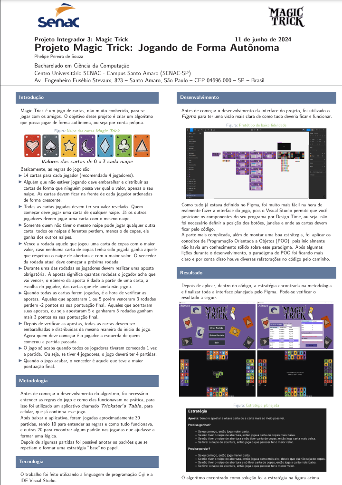

<h1 align="center">Projeto Integrador 3 - Magic Trick Sistema Autônomo</h1>

    Nesse projeto eu tive a oportunidade de colocar em prática os conhecimentos adquiridos durante o semestre. Foi criado um projeto com programação de computadores, modelagem a objetos e diagramas de casos de uso. 

    <a href="#-tecnologias">Tecnologias</a>&nbsp;&nbsp;&nbsp;|&nbsp;&nbsp;&nbsp;
    <a href="#-projeto">Projeto</a>&nbsp;&nbsp;&nbsp;|&nbsp;&nbsp;&nbsp;
    <a href="#-layout">Layout</a>&nbsp;&nbsp;&nbsp;|&nbsp;&nbsp;&nbsp;
    <a href="#-poster">Poster</a>

 

## 🚀 Tecnologias

Esse projeto foi desenvolvido utilizando a linguagem de programação C# com Windows Forms. A IDE para desenvolvimento utilizada foi [Visual Studio](https://visualstudio.microsoft.com/pt-br/downloads/).

## 💻 Projeto

O Projeto Integrador 3 do curso Bacharelado em Ciência da Computação é bem desafiador, porém muito interessante e divertido.  

Durante o 3º semestre, o projeto a ser desenvolvido é baseado em um jogo qualquer, decidido pelo professor responsável pela matéria. O nosso objetivo durante o semestre para esse projeto é aprender como funciona o paradigma de Programação Orientada a Objetos (POO) e aplicar dentro do código do jogo, que deve ser desenvolvido por nós programadores.  

Entendi!! então no 3º semestre nós vamos desenvolver um jogo ? Não!!! pelo menos não só isso, além de desenvolvedor a interface do jogo você vai precisar implementar uma estratégia para jogar esse jogo, ou seja, você vai precisar <b>criar um "bot" para jogar por você</b> contra os seus colegas de curso.  

No meu caso, o jogo escolhido pelo professor foi [Magic Trick](https://boardgamegeek.com/boardgame/383087/magic-trick), um jogo de cartas, as regras do jogo e outras informações sobre o jogo você pode conferir no meu <a href="#-poster">Poster</a>.  

Acredito que esse seja o projeto mais divertido de todo o curso Bacharelado em Ciência da Computação, então uma dica para todos é: se divirtam o máximo que poderem e vençam a competição.
## 📋 Layout 

Voce pode visualizar o wireframe do projeto através [DESSE LINK](https://www.figma.com/design/oWhn7fXmiVknlJnSCQdyaI/Magic-Trick-Wireframe?node-id=0-1). É necessário ter uma conta no [Figma](https://figma.com) para acessa-lo.

## 📜 Poster
Para baixar o poster, basta clicar na imagem abaixo:

---

Feito com 💜 by Phelipe Pereira :wave:
